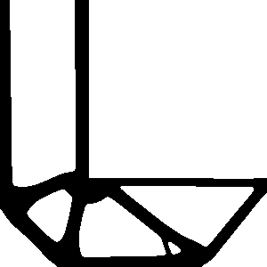
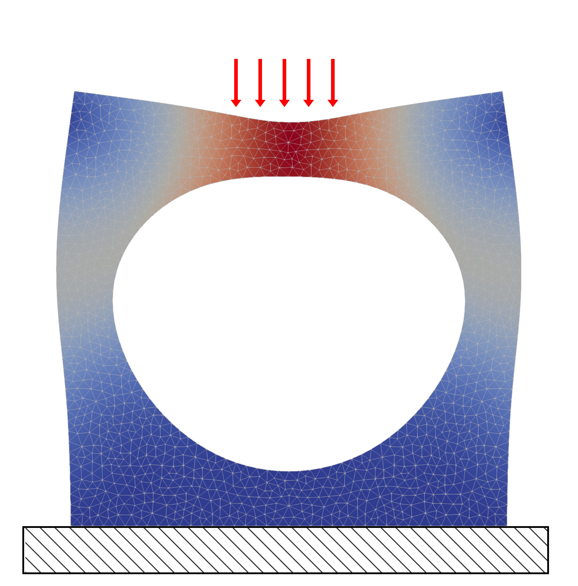
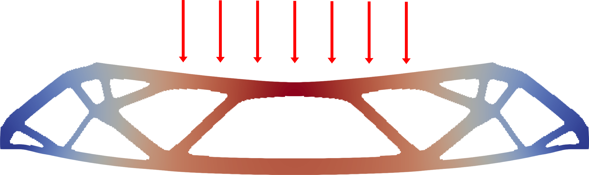

# Numerical Methods II Project: Topology Optimization with FEniCS

Final project for Numerical Methods II using topology optimization and
FEniCS finite element methods.

## Topology Optimization:

## FEniCS

