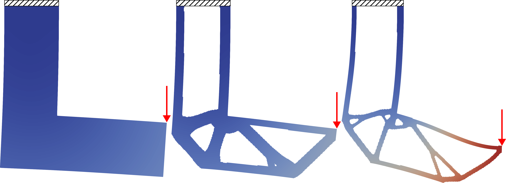
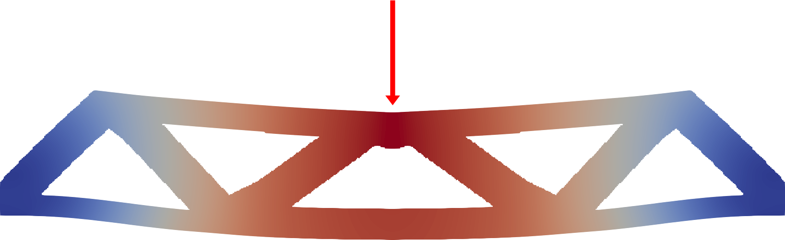
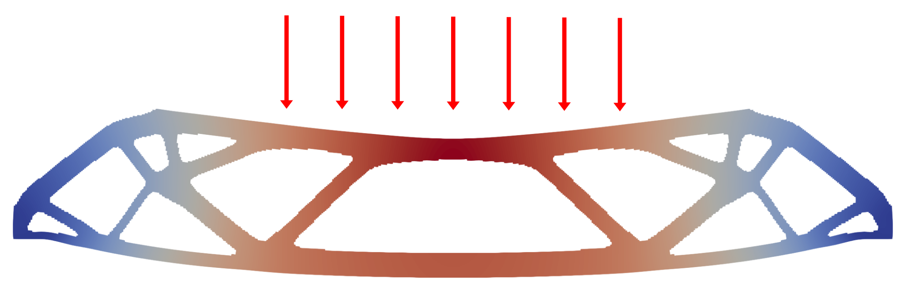
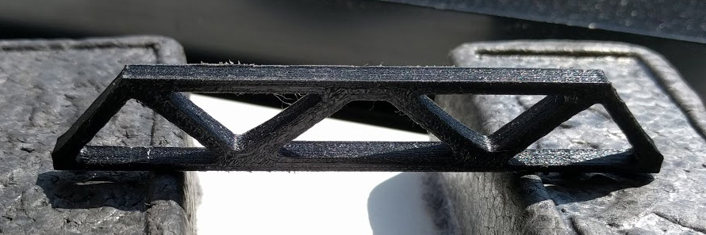

# Numerical Methods II Project: Topology Optimization with FEniCS

**Topology optimization with finite element analysis in FEniCS.**

#### Abstract

We present an implementation of topology optimization with a linear elasticity solver using [FEniCS](https://fenicsproject.org/). We approach the problem of minimizing compliance using solid isotropic material with penalization (SIMP). We generate an optimal structure given a load condition by optimizing the relative density of each element. To verify our solutions, we perform finite element analysis using FEniCS and conduct physical experimentation using fabricated instances of our results.

Created by Zachary Ferguson and Francis Williams for CSCI-GA.2420: Numerical Methods II (Spring 2018) at New York University.

#### Report
* <a href="Topology Optimization with FEniCS (Zachary Ferguson and Francis Williams).pdf">Topology Optimization with FEniCS (Zachary Ferguson and Francis Williams).pdf</a>

#### Presentation
* <a href="Topology Optimization with FEniCS - Presentation (Zachary Ferguson and Francis Williams).pdf">Topology Optimization with FEniCS - Presentation (Zachary Ferguson and Francis Williams).pdf</a>

<!-- ## Usage -->

## Results

### Topology Optimization

#### Single Load Bridge

We perform topology optimization of the Messerschmitt–Bölkow–Blohm (MBB) beam problem with the following boundary conditions.

**Single point load MBB-beam boundary consitions:**

 
Arrows are force vectors, and striping indicate fixed points.

**Solution to the single load MBB-beam problem:**

 
The problem is solved on a grid of size 360 x 60.
The optimization naturally tends towards to creating strut-like structures.

#### Distributed Load Bridge

We perform topology optimization of the MBB-beam problem with the following boundary conditions.

**Distributed load MBB-beam boundary consitions:**

 
Arrows are force vectors, and striping indicate fixed points.

**Solution to the distributed load MBB-beam problem:**

 
The problem is solve on a grid of size 600 x 100.
With higher resolution the optimization will place more fine struts.

#### L-bracket

We perform topology optimization of a L-bracket with a fixed top boundary and a point load on the right.
We use a passive element in the upper right corner to prevent material from filling the area.

**L-bracket boundary consitions:**

 
Arrows are force vectors, and striping indicate fixed points.

**Solution to the L-Bracket problem:**

 
Our optimization does not account for stress, so sharp features are not avoided (e.g. inside corner).

### Finite Element Analysis with FEniCS

To verify the output structures from our implementation can withstand the prescribed forces, we ran a finite-element simulation using [FEniCS](https://fenicsproject.org/), a finite element package.

**Initial meshed geometry:**

 
We start by meshing our geometry with [GMSH](http://gmsh.info/).

**Displacements under the assumption of linear elasticity:**

 
We then apply a distributed load (red arrows) with constrains on the position of the bottom edge (stripe pattern). The displacements are drawn after running the linear elasticity finite element simulation.

#### Topology Optimized Meshes

**Displacements computed for the optimized bridge:**

 
Results of simulating the optimized single load bridge using FEniCS.

**Displacements computed for the optimized bridge:**

 
Results of simulating the optimized distributed load bridge using FEniCS.

**Displacements computed for the L-bracket:**

 
The results of simulating the L-bracket shape. Left: 100%
material fill, a costly domain, as a point of comparison. Center:
meshed results of our topology optimization with a constrain of
36% of the total volume. Right: meshed result of our topology
optimization with a constraint of 18% of the total volume. As the
amount of material decreases the structure becomes less resilient.

### Fabricated Experiments

As a final verification, we fabricated the two bridge models. The first by slightly extruding it in 3D and 3D-printing it using an Ultimaker 3. The second by laser cutting a sheet of 1/8” acrylic using an Epilog Mini 24 Laser.

 
The 3D printed bridge model generated by our algorithm without additional mass.

 
The 3D printed bridge model generated by our algorithm both with additional mass.

 
Laser cut bridge model generated by our algorithm under no load.

 
Laser cut bridge model generated by our algorithm under a load provided by a clamp in the middle.

